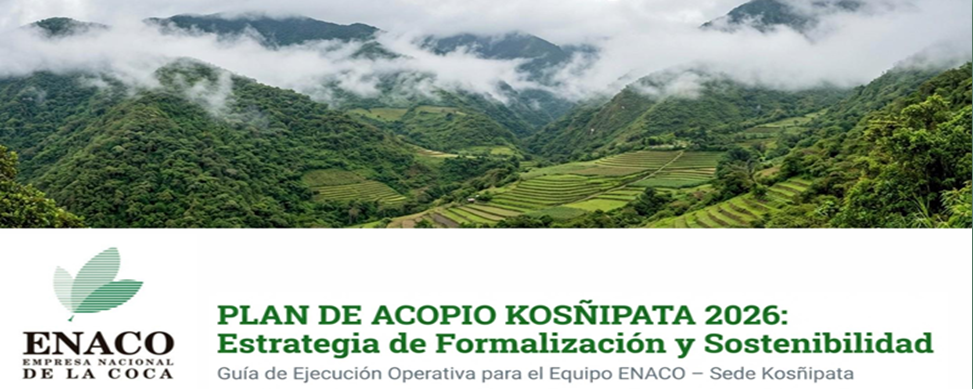
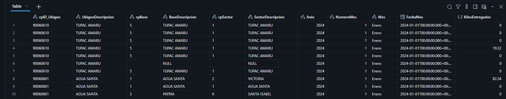
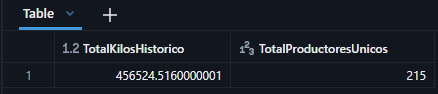
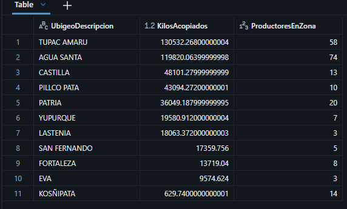
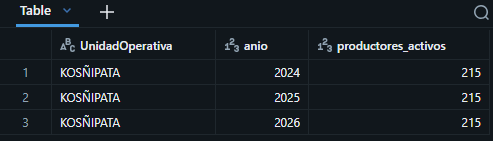
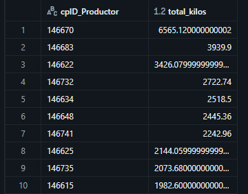
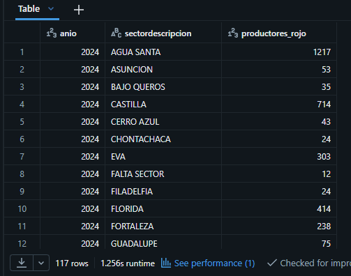
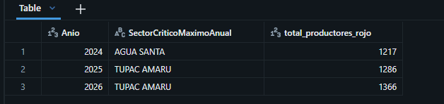
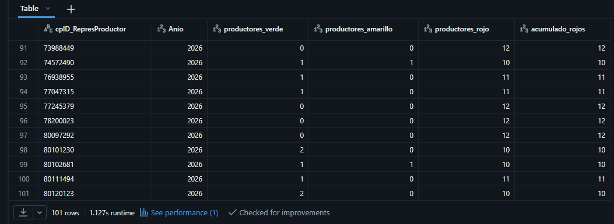

# SQL-SERVER-PROJECT-ENACO-ANALYTICS-2026

Este proyecto corresponde al reto final de análisis de datos, cuyo objetivo es aplicar conocimientos de SQL aplicados en la  plataforma de DATABRICKS, haciendo el análisis exploratorio y pensamiento analítico orientado al negocio para transformar datos reales en información útil para la toma de decisiones.



# Proyecto SQL: Análisis Comercial y Productivo de Hojas de Coca en ENACO

## Resumen (Overview)

El presente proyecto tiene como objetivo analizar información histórica relacionada con los **productores, representantes, unidades operativas y entregas de hojas de coca de ENACO S.A.**, utilizando **SQL Server** dentro de **DATABRISCKS** como principal herramienta de análisis.

A través del procesamiento y análisis de datos correspondientes al período **2024–2026**, se busca identificar patrones de comportamiento, evolución de las entregas, principales productores, representantes con mayor volumen, concentración de las entregas y variaciones significativas a través del tiempo.

El proyecto no se limita únicamente a la elaboración de consultas SQL, sino que busca aplicar un enfoque de **Business Analytics**, partiendo de preguntas de negocio y transformando los datos operativos en **KPIs, hallazgos e insights accionables**.

El análisis se desarrolla utilizando técnicas SQL de diferentes niveles de complejidad, incluyendo:

- Consultas de agregación.
- `JOIN`.
- `CASE WHEN`.
- CTEs.
- Subconsultas.
- Window Functions.
- `RANK()`.
- `ROW_NUMBER()`.
- Análisis de crecimiento interanual.
- Rankings.
- Participación porcentual.
- Análisis de concentración.

---

## 📩 Si quieres aprender SQL, conéctate conmigo

<p align="center">

  <a href="TU_LINK_LINKEDIN">
    
  </a>

  <a href="TU_LINK_GITHUB">
    
  </a>

</p>

---

# 📚 Estructura del Proyecto

- [Sobre los Datos](#sobre-los-datos)
- [Principales Entidades Analizadas](#principales-entidades-analizadas)
- [Contexto de Negocio](#contexto-de-negocio)
- [Objetivos](#objetivos)
- [Preguntas de Negocio](#preguntas-de-negocio)
- [Conclusiones](#conclusiones)
- [Tecnologías Utilizadas](#tecnologías-utilizadas)
- [Estructura del Repositorio](#estructura-del-repositorio)
- [Autor](#autor)

---

# Sobre los Datos

Los datos utilizados en este proyecto corresponden a información operacional relacionada con:

- Productores.
- Representantes.
- Unidades operativas.
- Ubicación geográfica.
- Base-Sector
- Entrega mensual de los kilso de hojas de coca.
- Años de operación.

El período analizado comprende:

**2024 – 2026**

La información permite estudiar el comportamiento histórico de las entregas y construir indicadores relacionados con el volumen de hojas de coca adquirido. Estas estan distribuidas en más de 36500 filas y 18 columnas.



---
# Principales entidades analizadas

| Entidad | Descripción |
|---|---|
| Productor | Persona registrada como productor(Títular) |
| Representante | Representante asociado al productor |
| Unidad Operativa | Unidad operativa donde se encuentra registrado el productor |
| Base | Base a la que pertenece el representante productor |
| Sector | Sector a la que pertenece el productor |
| Año | Año correspondiente a la entrega |
| Mes | Mes correspondiente a la entrega|
| Kilos Entregados | Peso convertido utilizado para el análisis |

---

# Contexto de Negocio

ENACO S.A. desarrolla actividades relacionadas con el acopio y comercialización de la hoja de coca dentro del marco establecido para esta actividad en el Perú.

La información operacional contiene registros históricos que permiten analizar el comportamiento de las entregas realizadas por productores, así como su relación con representantes y unidades operativas. (Base-Sector)

El análisis busca proporcionar una perspectiva orientada al negocio para responder preguntas como:

- ¿Qué unidades operativas concentran mayor volumen?
- ¿Qué productores tienen mayor participación?
- ¿Qué representantes gestionan mayor volumen?
- ¿Cómo ha evolucionado el volumen de entregas?
- ¿Qué productores presentan crecimiento?
- ¿Qué productores presentan disminución?
- ¿Qué productores presentan comportamientos atípicos?
- ¿Qué unidades operativas presentan mayor variabilidad?
- ¿Qué productores tienen una participación relevante dentro del volumen total?
- ¿En que estado se encuentra dicha (BASE-SECTOR)?

> **Nota:** Este proyecto tiene fines académicos y de portafolio. Los resultados dependen del conjunto de datos utilizado y no representan necesariamente indicadores oficiales publicados por ENACO S.A.

---

# Objetivos

## Objetivo General

Analizar mediante SQL Server el comportamiento histórico de las entregas de hojas de coca realizadas durante el período 2024–2026, con el propósito de identificar patrones, tendencias, concentración de volumen y oportunidades de análisis para la gestión comercial y operativa.

## Objetivos Específicos

- Analizar el volumen de entregas por año.
- Identificar las unidades operativas con mayor volumen.
- Identificar los principales productores.
- Analizar el desempeño de los representantes.
- Calcular variaciones interanuales.
- Identificar productores con crecimiento sostenido.
- Identificar productores con disminuciones significativas.
- Analizar la concentración del volumen.
- Detectar posibles inconsistencias en los datos.
- Validar relaciones entre productores y representantes.
- Analizar la variabilidad histórica de las entregas.
- Generar insights orientados a la toma de decisiones.

---

# Preguntas de Negocio

Para desarrollar el análisis se plantearon **15 preguntas de negocio**, organizadas en tres niveles de dificultad.

---

# 🟢 Nivel Básico

## **Pregunta nro 1: ¿Cuánto fue el total de acopio durante estos 3 años de los unicos productores y mapear cuántos productores únicos han entregado materia prima  ?**

### Solución

```SQL
    SELECT 
    SUM(Kilos) AS TotalKilosHistorico,
    COUNT(DISTINCT cpID_Productor) AS TotalProductoresUnicos
    FROM #BaseEntregasTemporal;
  ``` 

Análisis de la consulta: Se utilizan las funciones SUM() y COUNT(DISTINCT) para calcular el volumen total de kilos entregados y la cantidad de productores únicos registrados en el conjunto de datos.

Interpretación: El resultado permite dimensionar el volumen histórico de acopio y el universo de productores que participan en la actividad durante el período analizado.



## **PREGUNTA NRO 2: ¿Cuanto volumen captó cada regione geográfica(ubigeo) para priorizar esfuerzos logísticos y de transporte. Y por cuantos productores estan conformados cada una de estas regiones?**

### Solución

```SQL
    SELECT 
    UbigeoDescripcion,
    SUM(KilosEntregados) AS KilosAcopiados,
    COUNT(DISTINCT cpID_Productor) AS ProductoresEnZona
    FROM `bd_productores`.`default`.`data_productores_representantes_2024_2025_2026`
    GROUP BY UbigeoDescripcion
    ORDER BY KilosAcopiados DESC;
  ``` 



Análisis de la consulta: Se agrupan los registros por UbigeoDescripcion y se calculan los kilos acumulados y la cantidad de productores únicos por región, ordenando los resultados de mayor a menor volumen.

Interpretación: Los resultados permiten identificar las regiones que concentran mayores volúmenes de acopio y comparar su participación en relación con la cantidad de productores registrados.

## **PREGUNTA NRO3: ¿Cómo evoluciona la cantidad de productores activos año a año en cada sede operativa?**

### Solución


```SQL
-- Productores activos por Unidad Operativa y Año --
SELECT 
    UnidadOperativa, 
    Anio, 
    COUNT(DISTINCT cpID_Productor) AS productores_activos
FROM `bd_productores`.`default`.`data_productores_representantes_2024_2025_2026`
GROUP BY UnidadOperativa, Anio
ORDER BY UnidadOperativa, Anio ASC;

  ``` 

  



Insight de Negocio: Permite mapear la retención y la fidelidad del agricultor legal en las agencias de ENACO. Si una unidad operativa muestra una caída drástica de productores de un año a otro, evidencia un problema regional: migración de cultivos, impacto de plagas, o un incremento del atractivo económico del mercado informal en esa zona específica.
En ese caso cada año tiene la misma dantidad de productores.

## **PREGUNTA NRO4: ¿Quiénes son los 10 productores de mayor impacto por volumen acopiado en el último periodo fiscal (2026)?**

### Solución


```SQL
-- Top 10 productores por volumen anual (2026) --
SELECT 
    cpID_Productor, 
    SUM(KilosEntregados) AS total_kilos
FROM `bd_productores`.`default`.`data_productores_representantes_2024_2025_2026`
WHERE Anio = 2026
GROUP BY cpID_Productor
ORDER BY total_kilos DESC
LIMIT 10;

  ``` 



Insight de Negocio: Con este resultado no ayudaría a crear programas de incentivos técnicos (abonos, herramientas o asistencia técnica preferencial) dirigidos exclusivamente a estos 10 productores estratégicos para asegurar su permanencia en el padrón formal.

---
# 🟡 Nivel Intermedio

## **PREGUNTA NRO 5 :¿Cuántos productores se encuentran en estado Rojo (entregas < 57.5 kilos) por sector y por año (2024, 2025, 2026)?”**

### Solución


```SQL
SELECT 
    anio,
    sectordescripcion,
    COUNT(*) AS productores_rojo
FROM (
    SELECT 
        cpID_Productor,
        SectorDescripcion,
        Anio,
        CASE 
            WHEN KilosEntregados > 80.5 THEN 'Verde'
            WHEN KilosEntregados >= 57.5 THEN 'Amarillo'
            ELSE 'Rojo'
        END AS semaforo
    FROM `bd_productores`.`default`.`data_productores_representantes_2024_2025_2026`
) t
WHERE semaforo = 'Rojo'
  AND Anio IN (2024, 2025, 2026)
GROUP BY anio, sectordescripcion
ORDER BY anio, sectordescripcion;


  ``` 



- Clasificación semafórica: Aplica la regla de negocio para determinar el estado de cada productor según sus kilos entregados.

- Filtro de riesgo: Se enfoca únicamente en los productores que no alcanzan el mínimo esperado (Rojo).

- Segmentación temporal y sectorial: Permite ver la evolución anual y comparar entre sectores.


---

## **PREGUNTA NRO 7:¿Cuál es el sector geográfico que registró la mayor concentración de productores en nivel crítico ("Rojo") en cada año?**


### Solución
```SQL

-- Sector con mayor volumen acumulado de productores en alerta crítica (Rojo) por año --
WITH AlertaSectoresAnual AS (
    SELECT 
        Anio, 
        SectorDescripcion,
        COUNT(*) AS total_productores_rojo,
        ROW_NUMBER() OVER(
            PARTITION BY Anio 
            ORDER BY COUNT(*) DESC
        ) AS ranking_anual_maximo
    FROM (
        SELECT cpID_Productor, SectorDescripcion, Anio,
               CASE 
                   WHEN KilosEntregados > 80.5 THEN 'Verde'
                   WHEN KilosEntregados >= 57.5 THEN 'Amarillo'
                   ELSE 'Rojo'
               END AS semaforo
        FROM bd_productores.default.data_productores_representantes_2024_2025_2026
    ) t
    WHERE semaforo = 'Rojo'
    GROUP BY Anio, SectorDescripcion
)
SELECT 
    Anio, 
    SectorDescripcion AS SectorCriticoMaximoAnual, 
    total_productores_rojo
FROM AlertaSectoresAnual
WHERE ranking_anual_maximo = 1
ORDER BY Anio ASC;

  ``` 


Insight de Negocio: Este análisis eleva la perspectiva de control de un nivel operativo (mensual) a uno estratégico (anual). Identificar qué sector lidera las alertas rojas a nivel anual permite a la alta dirección de ENACO S.A. 


Acciones Recomendadas para la Alta Gerencia de ENACO S.A.

-  Intervención Inmediata en Tupac Amaru (Foco 2027):
Declarar el sector de Tupac Amaru en estado de atención prioritaria. Se debe desplegar un censo de campo para el primer trimestre del próximo periodo para entender por qué 1,366 productores empadronados están entregando volúmenes mínimos o nulos.
---


### **PREGUNTA NRO8:¿Cómo se distribuyen los productores según su nivel de entregas de hojas de coca (verde, amarillo y rojo) por representante durante el año 2026 en el sector Túpac Amaru, y cómo evoluciona la acumulación de productores con bajo nivel de entregas?**

### solucion
```SQL

SELECT 
    cpID_RepresProductor,
    Anio,
    SUM(CASE WHEN KilosEntregados > 80.5 THEN 1 ELSE 0 END) AS productores_verde,
    SUM(CASE WHEN KilosEntregados BETWEEN 57.5 AND 80.5 THEN 1 ELSE 0 END) AS productores_amarillo,
    SUM(CASE WHEN KilosEntregados < 57.5 THEN 1 ELSE 0 END) AS productores_rojo,
    SUM(SUM(CASE WHEN KilosEntregados < 57.5 THEN 1 ELSE 0 END)) OVER (PARTITION BY cpID_RepresProductor ORDER BY Anio) AS acumulado_rojos
FROM bd_productores.default.data_productores_representantes_2024_2025_2026
WHERE Anio = 2026 AND SectorDescripcion = 'TUPAC AMARU'

  ```

Análisis de la consulta: Se utilizan agregaciones condicionales con SUM(CASE WHEN ...) para clasificar los registros en verde, amarillo y rojo por representante. La función de ventana pretende calcular el acumulado de registros en rojo por representante a lo largo de los años.

Interpretación: La distribución permite comparar los niveles de entrega asociados a cada representante dentro del sector Túpac Amaru e identificar dónde se concentra la mayor cantidad de registros clasificados en rojo.

## CONCLUSIONES
- Análisis temporal: Se estructuró el análisis de entregas entre 2024 y 2026 para evaluar tendencias mensuales e interanuales, considerando que 2026 contiene información parcial hasta el 9 de octubre.
- Agregación geográfica: Se segmentaron los volúmenes de acopio por unidad operativa y sector para facilitar la comparación territorial y la identificación de concentraciones de entregas.
Ranking de productores: Se aplicaron funciones de agregación y ordenamiento para identificar a los productores con mayor contribución al volumen total de kilos entregados.
- Análisis por representante: Se evaluó la distribución de entregas por representante, considerando la relación de múltiples representantes con un mismo productor como una dimensión relevante para evitar duplicidades.
- Clasificación por umbrales: Se implementó una segmentación condicional de los niveles de entrega mediante CASE WHEN, clasificando los registros en categorías verde, amarillo y rojo según los umbrales definidos.
- Análisis acumulativo: Se utilizaron funciones de ventana para calcular acumulados por período y representante, permitiendo examinar la evolución de los indicadores entre años.
- Calidad de datos: Se identificó la importancia de validar la granularidad de los registros, las relaciones entre entidades y los posibles duplicados antes de calcular indicadores de productores y representantes.
- Aplicación de SQL analítico: Se integraron consultas con agregaciones, subconsultas, CTE y funciones de ventana para convertir datos operativos en indicadores orientados al análisis y la toma de decisiones.

(LA FUENTE DE DATOS FUERON SACADOS DE LA ENACO SAC.)